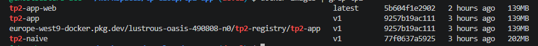
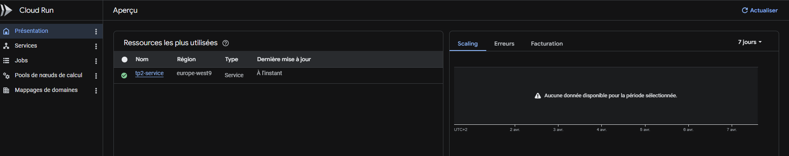

# TP 2 — Docker Avancé, Cloud Run & Networking GCP

**Cours 2 | Développer pour le Cloud | YNOV Campus Montpellier — Master 2**

**Date :** 07/04/2026
**Durée TP :** 3h
**Plateforme :** Google Cloud Platform

**Prérequis validés (Cours 1) :**

* Compte GCP actif
* gcloud configuré
* docker installé et fonctionnel
* Application Flask tp1-app/ opérationnelle en local

---

## Objectifs de ce TP :

* Optimiser un Dockerfile avec le build multi-stage
* Orchestrer une stack applicative avec Docker Compose (app + base de données)
* Pousser une image vers Google Artifact Registry
* Déployer l'application sur Cloud Run
* Configurer un VPC avec sous-réseaux et règles de pare-feu

---

## Livrables attendus :

* URL publique de votre application déployée sur Cloud Run (accessible depuis internet)
* Capture d'écran du terminal : `docker images` montrant la réduction de taille (standard vs multi-stage)
* Capture d'écran : service Cloud Run actif dans la console GCP
* Fichier `docker-compose.yml` fonctionnel
* `README.md` expliquant l'architecture et les commandes

---

# Partie 1 — Docker Multi-Stage Build (30 min)

Le build multi-stage permet de séparer l'environnement de compilation de l'environnement de production, réduisant drastiquement la taille de l'image finale.

---

## 1.1 — Comprendre le problème

Commençons par mesurer la taille d'une image "naïve".
Créez un nouveau dossier `tp2-app/` avec une application Node.js + TypeScript :

**tp2-app/src/index.ts :**

```ts
import express, { Request, Response } from 'express';

const app = express();
const PORT = parseInt(process.env.PORT || '8080', 10);

app.get('/', (req: Request, res: Response) => {
  res.json({
    message: 'Hello from YNOV Cloud TP2',
    version: '2.0.0',
    stage: process.env.APP_ENV || 'production',
  });
});

app.get('/health', (req: Request, res: Response) => {
  res.status(200).json({ status: 'ok' });
});

app.listen(PORT, '0.0.0.0', () => {
  console.log(`Server running on port ${PORT}`);
});
```

**tp2-app/package.json :**

```json
{
  "name": "tp2-app",
  "version": "2.0.0",
  "scripts": {
    "build": "tsc",
    "start": "node dist/index.js",
    "dev": "ts-node src/index.ts"
  },
  "dependencies": {
    "express": "^4.18.2"
  },
  "devDependencies": {
    "@types/express": "^4.17.21",
    "@types/node": "^20.11.5",
    "typescript": "^5.3.3"
  }
}
```

**tp2-app/tsconfig.json :**

```json
{
  "compilerOptions": {
    "target": "ES2020",
    "module": "commonjs",
    "outDir": "./dist",
    "rootDir": "./src",
    "strict": true,
    "esModuleInterop": true
  }
}
```

**Dockerfile naïf (tp2-app/Dockerfile.naive) :**

```dockerfile
FROM node:20-alpine
WORKDIR /app
COPY package*.json ./
RUN npm install
COPY . .
RUN npm run build
CMD ["node", "dist/index.js"]
```

```bash
cd tp2-app
# Builder l'image naïve
docker build -f Dockerfile.naive -t tp2-naive:v1 .
# Mesurer la taille
docker images tp2-naive:v1
# Notez la taille : 202 MB
```

---

## 1.2 — Dockerfile Multi-Stage

Créez le Dockerfile multi-stage `tp2-app/Dockerfile` :

```dockerfile
# ============================================
# Stage 1 : Build — Environnement de compilation
# ============================================
FROM node:20-alpine AS build
WORKDIR /app
COPY package*.json ./
COPY tsconfig.json ./
RUN npm install
COPY src/ ./src/
RUN npm run build

# ============================================
# Stage 2 : Runtime — Image de production minimale
# ============================================
FROM node:20-alpine AS runtime
WORKDIR /app
COPY package*.json ./
RUN npm ci --omit=dev
COPY --from=build /app/dist ./dist
RUN addgroup -S appgroup && adduser -S appuser -G appgroup
USER appuser
EXPOSE 8080
ENV APP_ENV=production
ENV NODE_ENV=production
CMD ["node", "dist/index.js"]
```

```bash
# Builder l'image multi-stage
docker build -t tp2-app:v1 .
# Comparer les tailles
docker images | grep tp2
# tp2-naive v1 202 MB
# tp2-app v1 139 MB
# Question : quelle est la réduction de taille en % ?
# Calcul : (taille_naive - taille_multistage) / taille_naive * 100 = 31.19 %
```



---

### Question

**Pourquoi les outils de build (TypeScript, gcc, etc.) ne doivent-ils pas être présents dans l'image de production ?**

**Réponse :**

1. Réduction de la taille de l'image
2. Sécurité (moins de surface d'attaque)
3. Production n'a besoin que du code compilé

---

## 1.3 — .dockerignore

Créez `tp2-app/.dockerignore` :

```text
node_modules
dist
*.log
.env
.git
*.md
Dockerfile*
docker-compose*
```

---

# Partie 2 — Docker Compose : Stack App + PostgreSQL (30 min)

Docker Compose orchestre plusieurs conteneurs en local. On simule ici un environnement de développement complet.

## 2.1 — Ajouter la connexion base de données

Modifiez `tp2-app/src/index.ts` pour ajouter une route `/db` et installer PostgreSQL :

```ts
import express, { Request, Response } from 'express';
import { Pool } from 'pg';

const app = express();
const PORT = parseInt(process.env.PORT || '8080', 10);

// Pool de connexion PostgreSQL
const pool = new Pool({
  host: process.env.DB_HOST || 'localhost',
  port: parseInt(process.env.DB_PORT || '5432', 10),
  database: process.env.DB_NAME || 'ynov_db',
  user: process.env.DB_USER || 'ynov',
  password: process.env.DB_PASSWORD || 'password',
});

app.get('/', (req: Request, res: Response) => {
  res.json({
    message: 'Hello from YNOV Cloud TP2',
    version: '2.1.0',
  });
});

app.get('/health', async (req: Request, res: Response) => {
  try {
    await pool.query('SELECT 1');
    res.status(200).json({
      status: 'ok',
      database: 'connected',
    });
  } catch (err) {
    res.status(503).json({
      status: 'error',
      database: 'disconnected',
    });
  }
});

app.get('/db', async (req: Request, res: Response) => {
  try {
    // Créer la table si elle n'existe pas et insérer une entrée
    await pool.query(`
      CREATE TABLE IF NOT EXISTS visits (
        id SERIAL PRIMARY KEY,
        visited_at TIMESTAMP DEFAULT NOW()
      )
    `);
    await pool.query('INSERT INTO visits DEFAULT VALUES');

    const result = await pool.query('SELECT COUNT(*) as total FROM visits');

    res.json({
      total_visits: parseInt(result.rows[0].total, 10),
    });
  } catch (err) {
    res.status(500).json({
      error: String(err),
    });
  }
});

app.listen(PORT, '0.0.0.0', () => {
  console.log(`Server listening on: ${PORT}`);
});
```
Ajouter pg aux dépendances dans package.json :

```bash
npm install pg
npm install --save-dev @types/pg
```

---

## 2.2 — docker-compose.yml

Créez tp2-app/docker-compose.yml en complétant les blancs :

```yaml
version: "3.9"
services:
# Service applicatif Node.js
  web:
    build: .
    ports:
    # Mapper le port 8080 local vers le port 8080 du conteneur
      - "8080:8080"
    environment:
      - APP_ENV=development
      # Nom du service PostgreSQL (résolution DNS automatique par Docker)
      - DB_HOST=db
      - DB_PORT=5432
      - DB_NAME=ynov_db
      - DB_USER=ynov
      - DB_PASSWORD=secret_password
    depends_on:
      db:
      # Attendre que le healthcheck PostgreSQL soit healthy
        condition: service_healthy
    networks:
      - app-network
# Service PostgreSQL
  db:
    image: postgres:16-alpine
    environment:
      - POSTGRES_DB=ynov_db
      - POSTGRES_USER=ynov
      - POSTGRES_PASSWORD=secret_password
    volumes:
    # Volume nommé pour la persistance des données
      - pgdata:/var/lib/postgresql/data
    healthcheck:
      test: ["CMD-SHELL", "pg_isready -U ynov -d ynov_db"]
      interval: 5s
      timeout: 5s
      retries: 5
    networks:
      - app-network

# Définition des volumes nommés
volumes:
  pgdata:

# Définition du réseau dédié
networks:
  app-network:
    driver: bridge
```

---

### Question

**Pourquoi utilise-t-on `condition: service_healthy` plutôt que `condition: service_started` ?**

**Réponse :**
Pour s'assurer que le service est prêt et fonctionnel avant que l'application web ne tente de se connecter.

---

## 2.3 — Lancer et tester la stack

```bash
# Démarrer tous les services en arrière-plan
docker-compose up -d
# Vérifier l'état des services (doivent être "running" et "healthy")
docker-compose ps
# Tester l'application
curl http://localhost:8080/
curl http://localhost:8080/health
curl http://localhost:8080/db # Premier appel → total_visits: 1
curl http://localhost:8080/db # Second appel → total_visits: 2
# Voir les logs en temps réel
docker-compose logs -f
# Arrêter sans supprimer les volumes (données conservées)
docker-compose stop
# Arrêter ET supprimer les volumes (reset complet)
docker-compose down -v
```

---

# Partie 3 — Google Artifact Registry & Push d'image Docker (20 min)

Artifact Registry est le registry privé de GCP. Il remplace Container Registry (gcr.io) et supporte Docker, Maven, npm,Python, etc.

## 3.1 — Créer un repository Artifact Registry

```bash
# Créer un repository Artifact Registry
# --repository-format=docker : type Docker
# --location : région GCP
gcloud artifacts repositories create tp2-registry \ 
    --repository-format=docker \ 
    --location=europe-west9 \ 
    --description="Registry TP2 YNOV"

# Lister les repositories existants
gcloud artifacts repositories list
```

## 3.2 — Authentifier Docker avec Artifact Registry
```bash
# Configurer Docker pour utiliser gcloud comme credential helper
# europe-west9-docker.pkg.dev est l'endpoint Artifact Registry pour Paris
gcloud auth configure-docker europe-west9-docker.pkg.dev
# Vérifier la configuration dans ~/.docker/config.json
cat ~/.docker/config.json | grep -A3 "credHelpers"
```

## 3.3 — Tagger et pousser l'image

```bash
# Format du tag pour Artifact Registry :
# [REGION]-docker.pkg.dev/[PROJECT_ID]/[REPOSITORY]/[IMAGE]:[TAG]
PROJECT_ID=$(gcloud config get-value project)
IMAGE_TAG="europe-west9-docker.pkg.dev/${PROJECT_ID}/tp2-registry/tp2-app:v1"

echo "Image tag : ${IMAGE_TAG}"

# Tagger l'image pour Artifact Registry
docker tag tp2-app:v1 ${IMAGE_TAG}

# Pousser l'image
docker push ${IMAGE_TAG}

# Vérifier que l'image est bien dans le registry
gcloud artifacts docker images list \ 
  europe-west9-docker.pkg.dev/${PROJECT_ID}/tp2-registry
```

---

# Partie 4 — Déploiement Cloud Run (30 min)

Cloud Run est le service PaaS serverless de GCP pour les conteneurs. Il scale automatiquement de 0 à N instancesselon le trafic, et vous ne payez qu'à l'usage.

## 4.1 — Déployer le service

```bash
PROJECT_ID=$(gcloud config get-value project)
IMAGE="europe-west9-docker.pkg.dev/${PROJECT_ID}/tp2-registry/tp2-app:v1"

gcloud run deploy tp2-service \ 
    --image=$IMAGE \ 
    --platform=managed \ 
    # Autoriser les requêtes non authentifiées (accès public)
    --allow-unauthenticated \ 
    --port=8080 \ 
    --memory=512Mi \ 
    --cpu=1 \ 
    --max-instances=3 \ 
    --set-env-vars="APP_ENV=production"
    
# La commande retourne une URL publique du type :
# https://tp2-service-xxxxxxxxxx-ew.a.run.app
```
**Note :** Cloud Run ne peut pas se connecter directement à votre PostgreSQL local. Pour ce TP, le service `/db` retournera une erreur de connexion — ce n'est pas un problème. On utilisera Cloud SQL en cours 4.



## 4.2 — Tester le déploiement

```bash
# Récupérer l'URL du service
SERVICE_URL=$(gcloud run services describe tp2-service \
  --region=europe-west9 \
  --format='value(status.url)')

echo "URL du service : ${SERVICE_URL}"

# Tester les endpoints
curl https://tp2-service-benkmw6xnq-od.a.run.app/
curl https://tp2-service-benkmw6xnq-od.a.run.app/health

# Vérifier les informations du service
gcloud run services describe tp2-service --region=europe-west9
```

### Question

**Quelle est la différence entre--max-instances=3 et --min-instances=1dans Cloud Run ?**

**Réponse :** 
--max-instances=3 : définit le nombre maximum d’instances que Cloud Run peut créer pour le service afin de gérer la charge.

--min-instances=1 : définit le nombre minimum d’instances qui doivent toujours rester actives, même en l’absence de trafic. Cela permet de réduire le temps de démarrage à froid pour les requêtes.

## 4.3 — Observer le comportement de scale à zéro

```bash
# Ne pas envoyer de requêtes pendant 5 minutes, puis relancer
# Cloud Run réduit les instances à 0 après inactivité (cold start)
# Mesurer le temps de réponse après inactivité
time curl ${SERVICE_URL}/health
# Question : Combien de ms pour le premier appel (cold start) ?
# Réponse : 
## real    0m0.083s
## user    0m0.032s
## sys     0m0.005s
# Combien de ms pour les appels suivants (warm) ?
# Réponse :
##real    0m0.096s
##user    0m0.034s
##sys     0m0.006s

##real    0m0.088s
##user    0m0.047s
##sys     0m0.013s
```

---

# Partie 5 — Networking : VPC & sous-réseaux (20 min)

GCP crée un VPC "default" automatiquement. Pour des déploiements professionnels, on crée son propre VPC avec dessous-réseaux isolés.

## 5.1 — Créer un VPC personnalisé

```bash
# Créer un VPC en mode custom (pas de sous-réseaux automatiques)
gcloud compute networks create tp2-vpc --subnet-mode=custom # custom ou auto ?

# Créer un sous-réseau public (pour les services exposés à internet)
gcloud compute networks subnets create tp2-subnet-public \
    --network=tp2-vpc \
    --region=europe-west9 \
    # Utiliser le bloc CIDR 10.10.1.0/24
    --range=10.10.1.0/24

# Créer un sous-réseau privé (pour les bases de données, non exposé)
gcloud compute networks subnets create tp2-subnet-private \
    --network=tp2-vpc \
    --region=europe-west9 \
    --range=10.10.2.0/24
```

**Pourquoi sépare-t-on les ressources applicatives et les bases de données dans des sous-réseaux différents ?**

**Réponse :** Séparer les sous-réseaux augmente la sécurité, optimise la performance et simplifie la gestion de l’infrastructure.

## 5.2 — Règles de pare-feu (Firewall Rules)

```bash
# Règle 1 : Autoriser le trafic HTTP (port 80) depuis internet vers le sous-réseau public
gcloud compute firewall-rules create tp2-allow-http \
 --network=tp2-vpc \
 --direction=INGRESS \
 --action=ALLOW \
 --rules=tcp:80 \
 --source-ranges=0.0.0.0/0 \
 --target-tags=http-server

# Règle 2 : Autoriser le trafic HTTPS (port 443)
gcloud compute firewall-rules create tp2-allow-https \
 --network=tp2-vpc \
 --direction=INGRESS \
 --action=ALLOW \
 --rules=tcp:443 \
 --source-ranges=0.0.0.0/0 \
 --target-tags=http-server

 # Règle 3 : Autoriser PostgreSQL (port 5432) UNIQUEMENT depuis le sous-réseau applicatif
gcloud compute firewall-rules create tp2-allow-postgres \
 --network=tp2-vpc \
  --direction=INGRESS \
   --action=ALLOW \
    --rules=tcp:5432 \
     --source-ranges=10.10.1.0/24 \
     --target-tags=db-server

# Uniquement depuis 10.10.1.0/24 (subnet public)

# Lister les règles de firewall du VPC
gcloud compute firewall-rules list --filter="network=tp2-vpc"
```
**Quelle est la différence entre unSecurity Group (AWS) et une Firewall Rule (GCP)?**

**Réponse :**  AWS contrôle au niveau des instances, GCP contrôle au niveau du réseau, mais les deux permettent de restreindre le trafic entrant et sortant selon les ports, protocoles et sources.

## 5.3 — Nettoyage du VPC

```bash
# Supprimer dans l'ordre inverse (les règles avant le VPC)
gcloud compute firewall-rules delete tp2-allow-http --quiet
gcloud compute firewall-rules delete tp2-allow-https --quiet
gcloud compute firewall-rules delete tp2-allow-postgres --quiet
gcloud compute networks subnets delete tp2-subnet-public --region=europe-west9 --quiet
gcloud compute networks subnets delete tp2-subnet-private --region=europe-west9 --quiet
gcloud compute networks delete tp2-vpc --quiet

echo "Nettoyage VPC terminé"
```
---

# Partie 6 — Cloud Storage Avancé : Versioning & Lifecycle (20 min)

En production, on ne supprime jamais accidentellement des fichiers. Le versioning et les règles de lifecycle protègentles données et optimisent les coûts.

## 6.1 — Bucket avec versioning activé

```bash
PROJECT_ID=$(gcloud config get-value project)
BUCKET="ynov-tp2-versioned-${PROJECT_ID}"

# Créer un bucket avec versioning activé dès la création
gcloud storage buckets create gs://${BUCKET} \
--location=europe-west9 \
 --uniform-bucket-level-access 
 # Contrôle d'accès unifié (recommandé)

# Activer le versioning sur le bucket
gcloud storage buckets update gs://${BUCKET} \
--versioning
# Flag pour activer le versioning

# Vérifier
gcloud storage buckets describe gs://${BUCKET} \
--format="value(versioning.enabled)"
# Résultat attendu : True
```

## 6.2 — Tester le versioning

```bash
# Créer et uploader un fichier
echo "Version 1 - $(date)" > config.json
gcloud storage cp config.json gs://${BUCKET}/

# Modifier et uploader une nouvelle version
echo "Version 2 - $(date)" > config.json
gcloud storage cp config.json gs://${BUCKET}/

# Uploader une 3ème version
echo "Version 3 - $(date)" > config.json
gcloud storage cp config.json gs://${BUCKET}/

# Lister TOUTES les versions (y compris les anciennes)
gcloud storage ls -a gs://${BUCKET}/config.json

# Question : combien de versions voyez-vous ?
# Réponse : 3

# Lire une ancienne version via son génération (numéro affiché dans ls -a)
# gcloud storage cp "gs://${BUCKET}/config.json#[NUMERO_GENERATION]" ./config_v1.json
```

## 6.3 — Règles de lifecycle automatisées

```bash
# Créer un fichier de règles lifecycle (JSON)
cat > lifecycle.json << 'EOF'
{
  "lifecycle": {
    "rule": [
      {
        "action": {
          "type": "Delete"
        },
        "condition": {
          "numNewerVersions": 3,
          "isLive": false
        }
      },
      {
        "action": {
          "type": "SetStorageClass",
          "storageClass": "NEARLINE"
        },
        "condition": {
          "age": 30,
          "isLive": true
        }
      }
    ]
  }
}
EOF

# New cat
cat > lifecycle.json << 'EOF'
{
  "rule": [
    {
      "action": {
        "type": "Delete"
      },
      "condition": {
        "numNewerVersions": 3,
        "isLive": false
      }
    },
    {
      "action": {
        "type": "SetStorageClass",
        "storageClass": "NEARLINE"
      },
      "condition": {
        "age": 30,
        "isLive": true
      }
    }
  ]
}
EOF

# Appliquer les règles lifecycle au bucket
gcloud storage buckets update gs://${BUCKET} \
  --lifecycle-file=lifecycle.json

# Vérifier les règles appliquées
gcloud storage buckets describe gs://${BUCKET} \
  --format="json(lifecycle)"

# new
gcloud storage buckets describe gs://${BUCKET} \
  --format="json(lifecycle_config)"
```

**Expliquez les deux règles lifecycle configurées ci-dessus. Quel est l'intérêt économique de passer en classe NEARLINE après 30 jours ?**

**Réponse :**

```texte
Règle 1 : 
isLive: false → cette règle s’applique uniquement aux anciennes versions d’un objet, pas à la version courante.
numNewerVersions: 3 → Google Cloud supprime une version lorsqu’il y a au moins 3 versions plus récentes de ce fichier.
Règle 2 : 
age: 30 → applique la règle 30 jours après la création de l’objet.
isLive: true → concerne uniquement la version actuelle de l’objet.
SetStorageClass: NEARLINE → change le type de stockage vers NEARLINE, conçu pour un accès moins fréquent mais moins coûteux.
Intérêt économique : La classe STANDARD coûte plus cher mais permet un accès rapide et fréquent.
La classe NEARLINE est ~4x moins chère pour le stockage, mais avec un coût d’accès plus élevé.
En déplaçant automatiquement les fichiers après 30 jours, on optimise le coût sans perturber l’accès aux fichiers récents.
```

## 6.4 — Nettoyage

```bash
# Supprimer TOUTES les versions (y compris les non-live)
gcloud storage rm -r --all-versions gs://${BUCKET}
```

---

# Partie 7 — Cloud Run Avancé : Révisions & Traffic Splitting (20 min)

Cloud Run gère des **révisions** (snapshots immuables d'un déploiement).
On peut router le trafic entre plusieurs révisions pour des déploiements progressifs.

---

## 7.1 — Déployer une nouvelle révision

On simule une mise à jour applicative en changeant une variable d'environnement (sans changer le code).

```bash
PROJECT_ID=$(gcloud config get-value project)
IMAGE="europe-west9-docker.pkg.dev/${PROJECT_ID}/tp2-registry/tp2-app:v1"

# Déployer une "v2" avec une variable d'environnement différente
# --no-traffic : la nouvelle révision ne reçoit PAS de trafic immédiatement
gcloud run deploy tp2-service \
  --image=${IMAGE} \
  --region=europe-west9 \
  --no-traffic \
  --set-env-vars="APP_ENV=production,APP_VERSION=2.0.0" \
  --tag=version2

# Lister les révisions
gcloud run revisions list \
  --service=tp2-service \
  --region=europe-west9
```

---

## 7.2 — Traffic Splitting (déploiement Canary)

#Router 80% du trafic vers la révision stable, 20% vers la nouvelle

#Récupérer les noms des 2 dernières révisions

```bash
# Récupérer les noms des 2 dernières révisions
REV_STABLE=$(gcloud run revisions list \
  --service=tp2-service \
  --region=europe-west9 \
  --format="value(name)" | sed -n '2p')  
  # 2ème = ancienne

REV_CANARY=$(gcloud run revisions list \
  --service=tp2-service \
  --region=europe-west9 \
  --format="value(name)" | sed -n '1p')  
  # 1ère = dernière (canary)

# Afficher les révisions
echo "Stable : ${REV_STABLE}"
echo "Canary : ${REV_CANARY}"

# Diviser le trafic : 80% stable, 20% canary
gcloud run services update-traffic tp2-service \
  --region=europe-west9 \
  --to-revisions="${REV_STABLE}=80,${REV_CANARY}=20"

# Vérifier la répartition du trafic
gcloud run services describe tp2-service \
  --region=europe-west9 \
  --format="yaml(status.traffic)"
```

---

## 7.3 — Tester la répartition

```bash
SERVICE_URL=$(gcloud run services describe tp2-service \
  --region=europe-west9 \
  --format="value(status.url)")

# Envoyer 10 requêtes et observer quelle version répond
for i in $(seq 1 10); do
  curl -s ${SERVICE_URL}/ | python3 -c"import sys,json; d=json.load(sys.stdin); 
print(d.get('stage','?'))"
done

# Question : sur 10 requêtes, combien environ ont reçu APP_VERSION=2.0.0 ?
# Je n'ai pas affiché APP_VERSION, mais environ 2 sur 10 auraient dû correspondre à 2.0.0 (20%).
# Résultat observé : production
production
production
production
production
production
production
production
production
production
# Explication mathématique (20% de 10 requêtes) :
Probabilité qu’une requête aille vers la canary : 20% = 0.2
Nombre de requêtes : 10

Nombre attendu de requêtes vers la canary :

10 × 0.2 = 2

Donc en moyenne 2 sur 10 devraient recevoir APP_VERSION=2.0.0.

Comme c’est probabiliste, le résultat exact peut varier à chaque essai (0, 1, 2, 3… selon le hasard).
```

7.4 — Basculer 100% vers la nouvelle révision (promotion)

---

# Partie 8 — Docker Compose : Ajouter un Cache Redis (20 min)

Les applications cloud utilisent souvent un cache en mémoire pour réduire la charge sur la base de données et accélérer les réponses.

---

## 8.1 — Ajouter Redis au `docker-compose.yml`

Modifiez `tp2-app/docker-compose.yml` pour ajouter un service Redis :

```yaml
# Ajouter ce service après "db:"
cache:
  image: redis:7-alpine
  command: redis-server --maxmemory 128mb --maxmemory-policy allkeys-lru
  ports:
    - "6379:6379"
  healthcheck:
    test: ["CMD", "redis-cli", "ping"]
    interval: 5s
    timeout: 3s
    retries: 3
  networks:
    - app-network
```

Ajouter la variable d'environnement Redis dans le service web :

```yaml
environment:
  - REDIS_HOST=cache
  - REDIS_PORT=6379
```

Et ajouter la dépendance :

```yaml
depends_on:
  db:
    condition: service_healthy
  cache:
    condition: service_healthy
```

## 8.2 — Ajouter la route /cached dans l'application

Ajoutez dans src/index.ts :

```TypeScript
import { createClient } from 'redis';

const redisClient = createClient({
  socket: {
    host: process.env.REDIS_HOST || 'localhost',
    port: parseInt(process.env.REDIS_PORT || '6379', 10),
  },
});

redisClient.connect().catch(console.error);

app.get('/cached', async (req: Request, res: Response) => {
  const CACHE_KEY = 'visit_count_cached';
  const TTL_SECONDS = 10;

  try {
    // Lire depuis le cache Redis
    const cached = await redisClient.get(CACHE_KEY);

    if (cached !== null) {
      return res.json({
        total_visits: parseInt(cached, 10),
        source: "cache",
        ttl_remaining: await redisClient.ttl(CACHE_KEY),
      });
    }

    // Cache miss : lire depuis PostgreSQL
    const result = await pool.query('SELECT COUNT(*) as total FROM visits');
    const count = parseInt(result.rows[0].total, 10);

    // Stocker dans Redis avec TTL de 10 secondes
    await redisClient.setEx(CACHE_KEY, TTL_SECONDS, String(count));

    return res.json({
      total_visits: count,
      source: "database",
    });

  } catch (err) {
    return res.status(500).json({ error: String(err) });
  }
});
```

Installer le client Redis :

```bash
# redis v4+ inclut ses propres types TypeScript — @types/redis n'existe plus
npm install redis
```

## 8.3 — Tester le cache

```bash
docker-compose up -d --build

# Première requête → source: "database" (cache froid)
curl http://localhost:8080/cached

# Requêtes suivantes dans les 10 secondes → source: "cache"
curl http://localhost:8080/cached
curl http://localhost:8080/cached

# Attendre 11 secondes et relancer → source: "database" (cache expiré)
sleep 11 && curl http://localhost:8080/cached
```

Questions

Question : Quel est l'intérêt du TTL (Time-To-Live) dans un cache ?
Réponse :
Le TTL permet d’expirer automatiquement les données du cache après un certain temps afin d’éviter de servir des données obsolètes et de garantir une meilleure cohérence avec la base de données.

Question : Dans quelle situation l'utilisation d'un cache Redis peut-elle poser un problème de cohérence des données ?

Réponse :
Un problème de cohérence peut apparaître lorsque les données sont mises à jour dans la base de données mais que le cache contient encore une ancienne valeur (cache stale). Pendant la durée du TTL, les utilisateurs peuvent recevoir des informations incorrectes si le cache n’est pas invalidé immédiatement après une modification.

# 🧹 Nettoyage Final

```bash
# Supprimer le service Cloud Run
gcloud run services delete tp2-service --region=europe-west9 --quiet

# Supprimer le repository Artifact Registry (et toutes les images)
gcloud artifacts repositories delete tp2-registry \
  --location=europe-west9 --quiet

# Vérification
gcloud run services list --region=europe-west9
gcloud artifacts repositories list --location=europe-west9
```

## 📊 Récapitulatif — Compétences validées

- [x] Docker multi-stage build *(réduction de taille d'image)*
- [x] Docker Compose avec PostgreSQL et Redis *(stack multi-services)*
- [x] Google Artifact Registry *(push et gestion d'images)*
- [x] Cloud Run *(déploiement, révisions, traffic splitting canary)*
- [x] VPC + Subnets + Firewall Rules GCP
- [x] Cloud Storage versioning et règles lifecycle
- [x] Cache Redis avec TTL et gestion de la cohérence

---

## 🎯 Pour le Cours 3 (28/04/2026)

- 📦 **Repository Git complet** avec :
  - `Dockerfile`
  - `docker-compose.yml`
  - `README`

- 🌐 **URL Cloud Run** de l'application déployée *(preuve de déploiement)*

- 🧾 **Journal des commandes exécutées** avec les résultats

---

## 🛠️ Installations utiles

```bash
# Installer kubectl
gcloud components install kubectl